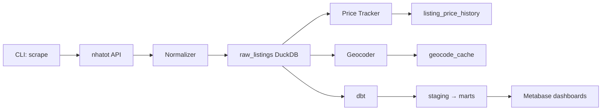

# Da Nang Real Estate Analytics — Project Spec (v2)

> **Changes from v1:** CLI-first (no Dagster in Phase 1), extended schema with all fields + price history, Nominatim-first geocoding, Metabase + DuckDB community driver, documented nhatot.com API.

---

## Overview

A self-hosted real estate analytics platform for the Da Nang market. Scrapes listing data from Vietnamese property portals (starting with nhatot.com's public API), normalizes and stores it in DuckDB, and surfaces insights via Metabase dashboards with map-based price visualization.

---

## Goals

- Track property listing prices across Da Nang by district and neighborhood
- Capture **all available listing fields** (not just core — including direction, legal status, floors, furniture, etc.)
- Track **price changes over time** per listing (re-scrape & diff)
- Identify price trends and high-growth zones
- Visualize price distribution geographically (map view)
- Build a clean, reusable dataset for future ML/analysis work

---

## Infrastructure

| Component | Choice | Notes |
|-----------|--------|-------|
| Orchestration | **CLI (Phase 1)** → Dagster (later) | Scrapers runnable via CLI; Dagster integration deferred |
| Transformation | dbt | dbt-duckdb adapter |
| Storage | DuckDB | Lightweight, file-based, no server needed |
| Dashboard | Metabase + DuckDB driver | [MotherDuck-Open-Source/metabase_duckdb_driver](https://github.com/MotherDuck-Open-Source/metabase_duckdb_driver) |
| Language | Python 3.11+ | Package manager: `uv` |
| Remote access | Tailscale | Already configured |

> [!NOTE]
> Use DuckDB (not Redshift) to keep this project isolated from Birdwatch infra.

### Metabase + DuckDB Setup

1. Download `duckdb.metabase-driver.jar` from [MotherDuck releases](https://github.com/MotherDuck-Open-Source/metabase_duckdb_driver/releases)
2. Copy to `<metabase>/plugins/` directory
3. Restart Metabase → DuckDB appears in database dropdown
4. Point to `./data/danang.duckdb` file path

---

## Data Sources

### Phase 1: nhatot.com (Chợ Tốt) — Public API

| Item | Detail |
|------|--------|
| **API Base** | `https://gateway.chotot.com/v1/public/` (also `v2` for some endpoints) |
| **Auth** | None required for public listing endpoints |
| **Format** | JSON |
| **Anti-bot** | Moderate — HTTP 429, IP blocking, TLS fingerprinting possible |
| **Official docs** | **None** — all endpoints are reverse-engineered from web/mobile app |

> [!WARNING]
> This is an undocumented internal API. All details below are from community research and may be inaccurate or change without notice. **Phase 0 (API exploration) must verify these before building the scraper.**

#### Key Endpoints

| Endpoint | Purpose | Confidence |
|----------|---------|------------|
| `GET /ad-listing?cg={cat}&region_v2={region}&...` | Search listings | ✅ Confirmed |
| `GET /ad-detail/{ad_id}` | Single listing detail | ✅ Confirmed |
| `GET /chapy-pro/regions` | All region codes | ⚠️ Unverified |
| `GET /chapy-pro/wards?region={id}` | Ward codes for a region | ⚠️ Unverified |
| `GET /chapy-pro/categories` | All category codes | ⚠️ Unverified |

#### Query Parameters (Search)

| Param | Description | Values | Confidence |
|-------|-------------|--------|------------|
| `cg` | Category | `1000` (RE umbrella) — sub-codes TBD | ⚠️ Needs verification |
| `region_v2` | City/region | Possibly `48` for Da Nang (VN admin code) | ⚠️ Needs verification |
| `o` | Offset (pagination) | `0`, `20`, `40`, ... | ✅ Likely |
| `page` | Page number (alt pagination) | May be 1-indexed | ⚠️ Needs verification |
| `limit` | Results per page | Default 20 | ✅ Likely |
| `w` | Search keyword | Free text | ✅ Likely |
| `st` | Status/sort type | `s,k` (observed) | ⚠️ Unclear |
| `key_param_included` | Include extra fields | `true` | ⚠️ Unverified |

#### Category Codes (⚠️ UNCONFIRMED)

Multiple conflicting sources. Possible mappings:

| Code | Possible Meaning (Source A) | Possible Meaning (Source B) |
|------|----------------------------|-----------------------------|
| `1000` | RE umbrella category | RE umbrella category |
| `1010` | Real estate for sale | Houses for sale |
| `1020` | Real estate for rent | Apartments |
| `1030` | — | Land |
| `1040` | — | Office/commercial |

> [!IMPORTANT]
> The sale vs rent distinction may be controlled by sub-category codes, an additional parameter (like `st`), or different URL path segments (`mua-ban-bat-dong-san` vs `cho-thue-bat-dong-san`). **Must verify in Phase 0.**

#### Response Format (Representative)

```json
{
  "total": 1250,
  "ads": [
    {
      "ad_id": 12345678,
      "list_id": 12345678,
      "subject": "Bán nhà mặt tiền đường Nguyễn Văn Linh",
      "price": 5000000000,
      "price_string": "5 tỷ",
      "area": 120,
      "region": 48,
      "region_name": "Đà Nẵng",
      "category": 1010,
      "params": {
        "size": 120,
        "ward": "Phường Hải Châu",
        "district": "Quận Hải Châu",
        "rooms": 3,
        "floors": 2,
        "house_direction": "Đông Nam"
      },
      "images": ["..."],
      "date": "2026-05-28",
      "account_id": "...",
      "account_name": "..."
    }
  ],
  "paging": {
    "page": 1,
    "limit": 20,
    "next_page": "/v1/public/ad-listing?page=2&..."
  }
}
```

> [!NOTE]
> Key observations:
> - Direction and district/ward may come as **strings** (not integer codes) inside a nested `params` object
> - Some fields like `price_string` provide pre-formatted Vietnamese price text
> - The `paging` object may include `next_page` for cursor-style pagination
> - The detail endpoint (`/ad-detail/`) likely returns more fields than the search endpoint

#### Pagination

- Likely **offset-based** using `o` parameter (0, 20, 40, ...)
- `page` parameter may also work (possibly 1-indexed)
- Response includes `total` count and `paging` object
- Empty `ads` array = end of results

#### Encoded Field Mappings (⚠️ Needs Phase 0 Verification)

**Direction** — may be integer codes OR Vietnamese strings depending on endpoint:
| Code | Value |
|------|-------|
| 1 | East (Đông) |
| 2 | West (Tây) |
| 3 | South (Nam) |
| 4 | North (Bắc) |
| 5 | Northeast (Đông Bắc) |
| 6 | Northwest (Tây Bắc) |
| 7 | Southeast (Đông Nam) |
| 8 | Southwest (Tây Nam) |

**Legal Document** — may be integer codes OR Vietnamese strings:
| Code | Value |
|------|-------|
| 1 | Sổ đỏ/Sổ hồng (LURC) |
| 2 | Hợp đồng mua bán (SPA) |
| 3 | Đang chờ sổ (Pending) |
| 4 | Khác (Other) |

#### Required Headers

```
User-Agent: Mozilla/5.0 (Linux; Android 13; ...) AppleWebKit/537.36 ...
Accept: application/json
Referer: https://www.chotot.com/
```

#### Known GitHub References

| Resource | Description |
|----------|-------------|
| `dhhiep/chotot-scraper` | Legacy scraper using the Chotot API |
| `haketa/chotot-scraper` (Apify) | Managed Apify Actor with proxy rotation |
| ChoTotOSS (GitHub org) | Official Chotot Engineering — internal tools, no API docs |

### Future Phases

| Priority | Site | Method | Notes |
|----------|------|--------|-------|
| 2 | batdongsan.com.vn | HTML scraping + Playwright | Richest data, heavier anti-bot |
| 3 | mogi.vn | HTML scraping | Moderate protection |
| 4 | alonhadat.com.vn | HTML scraping | Easier to scrape |

---

## Schema Design

### `raw_listings` — Raw scraped data

All fields captured from source, minimal transformation.

```sql
CREATE TABLE raw_listings (
    -- Identity
    listing_id      BIGINT NOT NULL,        -- ad_id from source
    source          VARCHAR NOT NULL,        -- 'nhatot' | 'batdongsan' | 'mogi' | 'alonhadat'
    url             VARCHAR,                 -- constructed from source + listing_id

    -- Core fields
    title           VARCHAR,                 -- subject
    description     VARCHAR,                 -- body
    category        INTEGER,                 -- raw category code
    property_type   VARCHAR,                 -- normalized: apartment | house | land | villa | shophouse | office
    transaction_type VARCHAR NOT NULL,       -- sale | rent

    -- Pricing
    price           BIGINT,                  -- VND (nullable for "giá thỏa thuận")
    price_per_sqm   DOUBLE,                  -- derived: price / area_sqm

    -- Property details
    area_sqm        DOUBLE,                  -- size field
    bedrooms        INTEGER,                 -- rooms
    bathrooms       INTEGER,                 -- toilets
    num_floors      INTEGER,                 -- number_of_floor
    direction       VARCHAR,                 -- decoded from direction code
    direction_code  INTEGER,                 -- raw direction code
    legal_status    VARCHAR,                 -- decoded from property_legal_document
    legal_status_code INTEGER,               -- raw legal document code
    furniture       VARCHAR,                 -- if available

    -- Location
    address_raw     VARCHAR,                 -- raw address text
    ward_code       INTEGER,                 -- numeric ward code from API
    district        VARCHAR,                 -- extracted/normalized
    ward            VARCHAR,                 -- extracted/normalized
    lat             DOUBLE,                  -- geocoded
    lng             DOUBLE,                  -- geocoded

    -- Seller
    account_id      BIGINT,
    account_name    VARCHAR,
    phone           VARCHAR,
    is_broker       BOOLEAN,                 -- flagged if account has 5+ active listings

    -- Images (URLs only — no local download)
    images          VARCHAR[],               -- array of image URLs/hashes from source

    -- Timestamps
    posted_at       TIMESTAMP,               -- list_time (unix → timestamp)
    scraped_at      TIMESTAMP NOT NULL,       -- when we collected it
    is_active       BOOLEAN DEFAULT TRUE,     -- updated on re-scrape

    -- Raw JSON backup
    raw_json        JSON,                    -- full API response for this listing

    PRIMARY KEY (listing_id, source)
);
```

### `listing_price_history` — Price change tracking

```sql
CREATE TABLE listing_price_history (
    listing_id      BIGINT NOT NULL,
    source          VARCHAR NOT NULL,
    price           BIGINT,
    price_per_sqm   DOUBLE,
    observed_at     TIMESTAMP NOT NULL,      -- when this price was seen
    previous_price  BIGINT,                  -- NULL if first observation
    price_change    BIGINT,                  -- current - previous (NULL if first)
    price_change_pct DOUBLE,                 -- percentage change

    FOREIGN KEY (listing_id, source) REFERENCES raw_listings(listing_id, source)
);
```

### `geocode_cache` — Avoid re-querying geocoder

```sql
CREATE TABLE geocode_cache (
    address_raw     VARCHAR PRIMARY KEY,
    lat             DOUBLE,
    lng             DOUBLE,
    geocoder_source VARCHAR,                 -- 'nominatim' | 'goong' | 'district_centroid'
    geocoded_at     TIMESTAMP,
    confidence      DOUBLE                   -- if available from geocoder
);
```

### `district_centroids` — Static fallback coordinates

```sql
CREATE TABLE district_centroids (
    district        VARCHAR PRIMARY KEY,
    lat             DOUBLE NOT NULL,
    lng             DOUBLE NOT NULL
);

-- Seed data for Da Nang districts:
-- Hải Châu:    16.0472, 108.2208
-- Thanh Khê:   16.0639, 108.1917
-- Sơn Trà:     16.1050, 108.2470
-- Ngũ Hành Sơn: 16.0194, 108.2536
-- Liên Chiểu:  16.0736, 108.1500
-- Cẩm Lệ:     16.0133, 108.2000
-- Hòa Vang:    15.9833, 108.0667
```

### `ward_mapping` — Ward code → name lookup (periodically refreshed)

```sql
CREATE TABLE ward_mapping (
    ward_code       INTEGER NOT NULL,
    ward_name       VARCHAR NOT NULL,
    district_name   VARCHAR NOT NULL,
    region_code     INTEGER NOT NULL,         -- e.g. 48 for Da Nang (TBD)
    fetched_at      TIMESTAMP NOT NULL,

    PRIMARY KEY (ward_code, region_code)
);
```

> [!NOTE]
> Refreshed monthly via `uv run danang-realestate refresh-wards`. Fetched from `/chapy-pro/wards` endpoint.

---

## Project Structure

```
danang-realestate/
├── pyproject.toml
├── uv.lock
├── .env                        # API keys, configs
├── data/
│   ├── danang.duckdb           # main database
│   └── district_centroids.csv  # static fallback coords
├── src/
│   └── danang_realestate/
│       ├── __init__.py
│       ├── cli.py              # CLI entry point (click/typer)
│       ├── config.py           # settings from .env
│       ├── db.py               # DuckDB connection manager
│       ├── models.py           # Pydantic models for listings
│       ├── scrapers/
│       │   ├── __init__.py
│       │   ├── base.py         # BaseScraper abstract class
│       │   └── nhatot.py       # nhatot.com API scraper
│       ├── pipeline/
│       │   ├── __init__.py
│       │   ├── geocoder.py     # address → lat/lng (Nominatim + fallback)
│       │   ├── normalizer.py   # decode enums, clean data
│       │   ├── price_tracker.py # detect & record price changes
│       │   └── loader.py       # write to DuckDB
│       ├── validation/
│       │   ├── __init__.py
│       │   └── schema_validator.py  # Pydantic response validation + drift detection
│       └── utils/
│           ├── __init__.py
│           ├── http.py         # httpx client with UA rotation, delays (curl_cffi fallback)
│           └── vietnamese.py   # VN text normalization helpers
├── dbt/
│   ├── dbt_project.yml
│   ├── models/
│   │   ├── staging/
│   │   │   └── stg_listings.sql
│   │   ├── intermediate/
│   │   │   └── int_listings_geocoded.sql
│   │   └── marts/
│   │       ├── listings.sql
│   │       ├── price_by_district.sql
│   │       ├── price_trend.sql
│   │       ├── price_changes.sql      # significant price movements
│   │       └── broker_listings.sql    # listings flagged as broker/agent
├── tests/
│   ├── test_scraper_nhatot.py
│   ├── test_normalizer.py
│   └── test_geocoder.py
└── README.md
```

### Key structural changes from v1

- `src/` layout with proper Python package structure
- `cli.py` as entry point (replaces Dagster for Phase 1)
- Added `price_tracker.py` for price change detection
- Added `validation/schema_validator.py` for API response validation + schema drift detection
- Added `utils/http.py` for centralized HTTP client config (httpx primary, curl_cffi fallback)
- Added `utils/vietnamese.py` for VN text handling
- Added `tests/` directory
- Added `price_changes.sql` and `broker_listings.sql` mart models

---

## Data Pipeline



### CLI Commands (Phase 1)

```bash
# Scrape all sale listings in Da Nang
uv run danang-realestate scrape --type sale --region danang

# Scrape all rent listings
uv run danang-realestate scrape --type rent --region danang

# Scrape both
uv run danang-realestate scrape --type all --region danang

# Re-check active listings for price changes
uv run danang-realestate rescrape --check-prices

# Run geocoding on un-geocoded listings
uv run danang-realestate geocode

# Run dbt transformations
uv run danang-realestate transform

# Full pipeline: scrape → geocode → transform
uv run danang-realestate run-all

# Refresh ward code → name mapping from API
uv run danang-realestate refresh-wards

# Validate API response schema (check for drift)
uv run danang-realestate validate-schema
```

---

## Geocoding Strategy

Tiered approach (Nominatim-first for Phase 1):

| Tier | Provider | Notes |
|------|----------|-------|
| 1 | **Nominatim (OpenStreetMap)** | Free, no API key, 1 req/sec rate limit |
| 2 | **Static district centroids** | Fallback from `district_centroids.csv` |
| 3 | **Goong Maps API** *(future)* | Vietnamese geocoder, 10k free req/month, add when API key available |

All results cached in `geocode_cache` table to avoid re-querying.

> [!IMPORTANT]
> Nominatim's usage policy requires max 1 request/second and a custom `User-Agent` identifying your app. We must respect this.

---

## Anti-Scraping Mitigation

> [!CAUTION]
> nhatot.com's API has **more anti-bot protection than initially assumed**: HTTP 429 rate limiting, IP-based blocking, potential TLS/JA3 fingerprinting, and Cloudflare protection on some endpoints.

### Baseline measures (all scrapers)
- Rotate `User-Agent` headers (mobile browser UAs)
- Randomized delays between requests (2–8 seconds, configurable via `.env`)
- `httpx` with HTTP/2 support (better TLS fingerprint)
- Rate limit: max 1 request/3 seconds per domain
- Respect `robots.txt` where applicable
- Include `Referer: https://www.chotot.com/` header

### nhatot.com specific
- Use mobile app user-agent strings
- Set `Accept: application/json` header
- Consider `curl_cffi` if `httpx` gets fingerprinted (TLS/JA3 mimicking)
- Monitor for HTTP 429 responses → back off exponentially
- If IP-blocked: consider rotating residential proxies (future)

### batdongsan.com.vn (Phase 7)
- Playwright for JS-rendered pages
- Full browser simulation may be required

---

## dbt Models

### Staging
- `stg_listings` — dedup raw listings, cast types, basic null handling, decode enum fields

### Intermediate
- `int_listings_geocoded` — join with geocode cache, add lat/lng

### Marts
- `listings` — final clean table, one row per listing (latest state)
- `price_by_district` — avg/median price and price_per_sqm by district + property_type
- `price_trend` — weekly median price per district
- `price_changes` — listings with significant price movements (>5% change)
- `broker_listings` — accounts with 5+ active listings flagged as brokers, with `broker_listing_count`

---

## Metabase Dashboards

### Dashboard 1: Market Overview
- Total active listings by type (bar chart)
- Median price by district (table + bar)
- Price distribution histogram
- Listings with/without legal documents (pie chart)

### Dashboard 2: Map View
- Pin map: each listing as a dot, color = price_per_sqm bucket
- Heatmap layer: price density by area (if Metabase version supports)
- Filters: property type, transaction type, date range, legal status

### Dashboard 3: Trend Analysis
- Weekly median price per district (line chart)
- New listings volume over time
- Price change alerts (listings re-scraped with different price)
- Direction distribution by district (radar/bar chart)

> [!TIP]
> Metabase's native pin map requires `latitude` and `longitude` columns — these must be present in the mart table. For richer map UX, consider exporting to Kepler.gl as a secondary view.

---

## Dependencies

```toml
[project]
name = "danang-realestate"
requires-python = ">=3.11"

dependencies = [
    "httpx[http2]",
    "beautifulsoup4",
    "lxml",
    "duckdb",
    "dbt-duckdb",
    "pydantic>=2.0",
    "pydantic-settings",     # config from .env
    "tenacity",              # retry logic
    "python-dotenv",
    "pandas",
    "rich",                  # CLI progress/tables
    "typer",                 # CLI framework
    "geopy",                 # Nominatim geocoding
]

[project.optional-dependencies]
curl-cffi = ["curl_cffi"]       # TLS fingerprint fallback if httpx gets blocked
playwright = ["playwright"]     # only needed for Phase 7 (batdongsan)
dagster = ["dagster", "dagster-duckdb"]  # deferred to later phase

[project.scripts]
danang-realestate = "danang_realestate.cli:app"
```

> [!NOTE]
> Removed `playwright` and `dagster` from core deps. They're optional extras to keep the initial install lean.

---

## Environment Variables (.env)

```env
# Geocoding (optional in Phase 1)
GOONG_API_KEY=              # leave empty; Nominatim used as default

# Database
DUCKDB_PATH=./data/danang.duckdb

# Scraping
SCRAPE_DELAY_MIN=2
SCRAPE_DELAY_MAX=8
SCRAPE_USER_AGENT=Mozilla/5.0 (Linux; Android 13) AppleWebKit/537.36 ...

# Nominatim
NOMINATIM_USER_AGENT=danang-realestate/0.1.0 (personal-project)
```

---

## Milestones (Revised)

| Phase | Deliverable | Depends On | Status |
|-------|-------------|------------|--------|
| **0** | **API exploration** — verify endpoints, region/category codes, response schema via browser DevTools or test requests | — | ✅ Complete |
| **1** | nhatot.com scraper + CLI + data into DuckDB | Phase 0 | ✅ Complete |
| **2** | Normalizer (decode enums, clean data) + price tracker | Phase 1 | ✅ Complete |
| **3** | Geocoder pipeline (Nominatim + district fallback) | Phase 1 | ✅ Complete |
| **4** | dbt models (staging → marts) | Phases 2–3 | ✅ Complete |
| 5 | Metabase connected + Market Overview dashboard | Phase 4 | ⏳ Planned |
| 6 | Map dashboard live | Phase 5 | ⏳ Planned |
| 7 | Add batdongsan + mogi scrapers (Playwright) | Phase 1 | ⏳ Planned |
| 8 | Dagster scheduling + daily runs | Phase 4 | ⏳ Planned |
| 9 | Price trend tracking (re-scrape + diff dashboards) | Phases 2, 5 | ⏳ Planned |

### Phase 0: API Exploration (Confirmed Findings)

The nhatot.com API has been successfully analyzed and reverse-engineered:

1. **Region code for Da Nang**: Confirmed as `3017` (combined from region `3` and area `17`).
2. **Category codes**: Verified real estate categories are:
   - `1010` (Căn hộ/Chung cư - Apartment)
   - `1020` (Nhà ở - House)
   - `1030` (Văn phòng, Mặt bằng - Office/Commercial)
   - `1040` (Đất - Land)
   - `1050` (Phòng trọ - Rental rooms)
3. **Transaction type**: Sale is mapped to `st=s` (or `st=s,k`), Rent is mapped to `st=u` (or `st=u,h`).
4. **Pagination**: Verified offset-based pagination using the `o` (offset) and `limit` query parameters.
5. **Response schema**: Search returns a list of ads with top-level fields like `rooms`, `toilets`, `floors`, `price`, `size`, `latitude`, `longitude`, `seller_info`, and a list of params (e.g. `direction`).
6. **Detail endpoint**: `/v1/public/ad-detail/{id}` returns `{"ad": {...}}` containing unmasked parameters but masked phone numbers (`091813****`).
7. **Ward mapping**: Wards are fetched using the `v2` endpoint `/v2/public/chapy-pro/wards` with `region=3017` and `area={district_code}` (where district codes range from `301701` to `301707`).

---

## Out of Scope (v1)

- ML price prediction model
- Public-facing web app
- National coverage (Da Nang only)
- Real-time alerts / notifications
- Goong Maps integration (deferred until API key available)
- Vietnam Digital Real Estate ID integration (Decree 357/2025 — interesting future enrichment)

---

## Resolved Decisions

All open questions have been resolved:

| # | Question | Decision |
|---|----------|----------|
| 1 | **API stability** | ✅ Build Pydantic response validation + schema drift logging. `validate-schema` CLI command to check on demand. Log warnings when unexpected fields appear or expected fields disappear. |
| 2 | **Image storage** | 🔗 Keep URLs only — no local download. Store in `images VARCHAR[]` column. |
| 3 | **Seller dedup / broker detection** | 🏷️ Flag accounts with 5+ active listings as brokers. `is_broker` column on `raw_listings`, `broker_listings` dbt mart for analysis. |
| 4 | **Ward code mapping** | 🔄 Periodically refresh (monthly) via `refresh-wards` CLI command. Stored in `ward_mapping` table. |
| 5 | **TLS fingerprinting** | 🔧 Start with `httpx` (HTTP/2). Fall back to `curl_cffi` (optional dep) only if blocked. |
| 6 | **Schema flexibility** | 📋 Store both forms: decoded string + raw code in separate columns (e.g. `direction` + `direction_code`), plus full `raw_json` as authoritative backup. |
